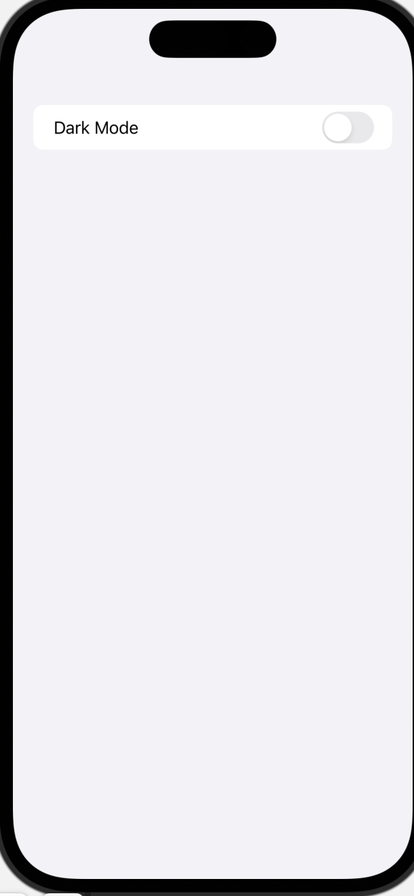

# 一些大家写的animation 速查

看到很多分享的好的项目，这里截图记录下来到时候想用可以快速找到。

https://github.com/Hansaanuradha93/Animations-SwiftUI.git

已经pull到本地。

可动态调整的form

  

一键切换黑暗模式（设置Theme 这个项目也不错）：

  

可以拖动的球：

  

动态一坨，可以当背景

  

